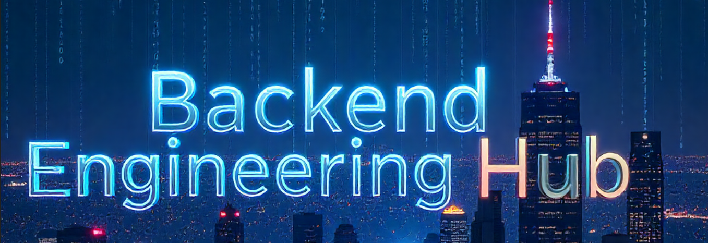

  

  
  

  
  

# 🚀 Awesome Backend Roadmap

A curated collection of the best resources for becoming a proficient backend engineer in 2025 and beyond. This roadmap provides a step-by-step guide, from picking your first language to designing large-scale distributed systems.

## 🤔 Why This Roadmap?

* **Structured Learning:** We use a tiered approach to guide you from fundamental concepts to advanced mastery, preventing information overload.
* **Quality Over Quantity:** Every resource is carefully selected based on community recommendations, reviews, and its value in modern software development.
* **Focus on Fundamentals:** This roadmap emphasizes the "why" behind the "what," building a deep understanding that transcends specific tools and frameworks.

## 🗺️ How to Use This Roadmap

1.  **Don't Get Overwhelmed:** You don't need to learn everything at once. This is a long-term guide.
2.  **Start with a Language:** Pick one language from the `Programming Language` section and focus on its Tier 1 and Tier 2 resources.
3.  **Build While You Learn:** The most crucial step. For every topic you learn (e.g., Databases, Caching), immediately apply it by building a small project. Theory is nothing without practice.
4.  **Come Back Often:** Bookmark this guide and return to it as you progress in your career to tackle the next tier or a new topic.

---

## 📖 Essential Resources

### 🏛️ Core Foundation
The cornerstone resource that connects almost every topic in this roadmap. Read it once at the beginning of your journey and re-read it every year.

* [**Designing Data-Intensive Applications by Martin Kleppmann**](https://www.amazon.in/Designing-Data-Intensive-Applications-Reliable-Maintainable/dp/9352135245) - The definitive guide to understanding the architecture of modern data systems.

### 📚 Free Ebooks Collection
High-quality, freely available books that complement the paid resources above.

* [**Pro Git Book**](https://git-scm.com/book/en/v2) - The comprehensive guide to Git version control
* [**Green Tea Press - Free CS Books**](https://greenteapress.com/wp/) - Collection including "Think Python", "Think Java", and more
* [**Eloquent JavaScript**](https://eloquentjavascript.net/) - A beautifully written, free online book for JavaScript
* [**The Go Programming Language Specification**](https://go.dev/ref/spec) - The authoritative language reference
* [**Rust Book**](https://doc.rust-lang.org/book/) - The official, comprehensive Rust programming guide
* [**Database Systems: The Complete Book**](http://infolab.stanford.edu/~ullman/dscb.html) - Stanford's database systems textbook
* [**Introduction to Algorithms (Selected Chapters)**](https://mitpress.mit.edu/9780262046305/introduction-to-algorithms/) - MIT's algorithm bible (some chapters freely available)

### 🎥 Video Course Collections
Comprehensive video-based learning paths organized by platform.

#### YouTube Channels
* [**Hussein Nasser**](https://www.youtube.com/@hnasr) - Deep dives into backend technologies and protocols
* [**Gaurav Sen**](https://www.youtube.com/@GauravSensei) - System design interview preparation
* [**freeCodeCamp.org**](https://www.youtube.com/@freecodecamp) - Full-length courses on various topics
* [**MIT OpenCourseWare**](https://www.youtube.com/@mitocw) - University-level computer science courses

#### Premium Platforms
* [**Udemy Backend Courses**](https://www.udemy.com/topic/back-end-development/) - Practical, project-based learning
* [**Pluralsight Backend Path**](https://www.pluralsight.com/browse/software-development/back-end) - Comprehensive skill paths
* [**Coursera System Design**](https://www.coursera.org/specializations/computer-systems-design) - University-partnered specializations

### 📰 Blogs & Articles
Stay updated with industry trends and deep technical insights.

#### Company Engineering Blogs
* [**Netflix Tech Blog**](https://netflixtechblog.com/) - Microservices, streaming, and scale
* [**Uber Engineering**](https://eng.uber.com/) - Real-time systems and data processing
* [**Twitter Engineering**](https://blog.twitter.com/engineering/en_us) - Social media scale challenges
* [**Instagram Engineering**](https://instagram-engineering.com/) - Photo sharing infrastructure
* [**Airbnb Engineering**](https://medium.com/airbnb-engineering) - Marketplace and booking systems

#### Individual Technical Blogs
* [**Martin Fowler**](https://martinfowler.com/) - Software architecture and design patterns
* [**High Scalability**](http://highscalability.com/) - System architecture case studies
* [**All Things Distributed**](https://www.allthingsdistributed.com/) - AWS CTO's insights on distributed systems

---

## 🛠️ Technical Skills Roadmap

### 🔤 Programming Languages
Master one language first before trying to learn others. The goal is to write clean, efficient, and idiomatic code.

#### 🐍 Python
* **Tier 1: The Basics**
    * [**Python for Everybody (Course)**](https://www.py4e.com/book) - An incredibly accessible university-level course that's perfect for absolute beginners.
    * [**Exercism's Python Track (Practice)**](https://exercism.org/tracks/python) - Solve coding problems and get mentored for free. The best way to get hands-on.
* **Tier 2: Effective Python**
    * [**Python Crash Course (Book)**](https://www.amazon.in/Python-Crash-Course-2nd-Edition/dp/1593279280) - A project-based book to start building real applications.
    * [**Official Python Tutorial (Docs)**](https://docs.python.org/3/tutorial/) - When in doubt, go to the source. It's concise and comprehensive.
* **Tier 3: Mastery**
    * [**Fluent Python (Book)**](https://www.amazon.in/Fluent-Python-Concise-Effective-Programming/dp/9352132335) - The ultimate book for understanding how to write "Pythonic" code. This separates the amateurs from the pros.

#### 🐹 Go (Golang)
* **Tier 1: The Basics**
    * [**A Tour of Go (Official Tour)**](https://go.dev/tour/) - The non-negotiable, interactive starting point for every new Go developer.
    * [**Go by Example (Website)**](https://gobyexample.com/) - A fantastic hands-on reference for core language features.
* **Tier 2: Effective Go**
    * [**The Go Programming Language (Book)**](https://www.gopl.io/) - The "Go Bible" by Donovan & Kernighan. An authoritative and essential text.
    * [**Go: The Complete Developer's Guide (Course)**](https://www.udemy.com/course/go-the-complete-developers-guide/) - A very popular Udemy course that builds practical applications.
* **Tier 3: Mastery**
    * [**Effective Go (Docs)**](https://go.dev/doc/effective_go) - The official guide on writing clean, idiomatic Go.
    * Explore standard library source code to understand implementation details.

#### 📜 JavaScript (Node.js)
* **Tier 1: The Basics**
    * [**MDN Web Docs for JavaScript (Reference)**](https://developer.mozilla.org/en-US/docs/Web/JavaScript) - The best and most accurate reference for the JS language.
    * [**freeCodeCamp - Backend APIs (Course)**](https://www.freecodecamp.org/learn/back-end-development-and-apis/) - A full, project-based curriculum for learning Node.js.
* **Tier 2: Effective JavaScript**
    * [**Eloquent JavaScript (Book)**](https://eloquentjavascript.net/) - A beautifully written (and free online) book that teaches you to think like a programmer.
    * [**NodeSchool.io (Workshops)**](https://nodeschool.io/) - Interactive, self-guided command-line workshops.
* **Tier 3: Mastery**
    * [**Node.js Design Patterns (Book)**](https://www.nodejsdesignpatterns.com/) - Learn to build enterprise-grade, scalable applications in Node.js.
    * Explore popular library source code (e.g., Express, Fastify) to understand how they work.

### 🔌 API Design & Development
* **Tier 1: REST Fundamentals**
    * [**Richardson Maturity Model (Article)**](https://martinfowler.com/articles/richardsonMaturityModel.html) - Essential reading to understand what makes an API truly "RESTful".
    * [**What is REST (Video)**](https://www.youtube.com/watch?v=qVTAB8Z2VmA) - A great conceptual overview from Hussein Nasser.
* **Tier 2: Best Practices & Standards**
    * [**Microsoft API Design Guidance (Docs)**](https://learn.microsoft.com/en-us/azure/architecture/best-practices/api-design) - A fantastic, vendor-neutral guide on API best practices.
    * [**Build APIs You Won't Hate (Book)**](https://apisyouwonthate.com/books/build-apis-you-wont-hate) - A pragmatic and popular book on creating usable and maintainable APIs.
* **Tier 3: Advanced API Patterns**
    * **GraphQL** - Learn query-based APIs
    * **gRPC** - High-performance RPC framework
    * **WebSockets** - Real-time communication

### 🗄️ Database Technologies

#### Fundamentals
* [**Use The Index, Luke! (Website)**](https://use-the-index-luke.com/) - A masterclass on database indexing, the most important topic for performance.
* [**CMU Intro to Database Systems (Course)**](https://www.youtube.com/playlist?list=PLSE8OD_ftxgvWwpaVyMMProV454h2M-4w) - A free, university-level course for a deep, foundational understanding.

#### 🐘 Relational Databases (PostgreSQL)
* **Tier 1: SQL Mastery**
    * [**Postgres Exercises (Interactive)**](https://pgexercises.com/) - Learn SQL by doing.
* **Tier 2: PostgreSQL Deep Dive**
    * [**Official PostgreSQL Documentation (Docs)**](https://www.postgresql.org/docs/) - World-class documentation. Learn to navigate it.
    * Learn about `EXPLAIN ANALYZE` to debug your query performance.
* **Tier 3: Advanced Features**
    * **Stored Procedures & Functions**
    * **Full-Text Search**
    * **JSON/JSONB Operations**

#### 🍃 NoSQL Databases (MongoDB)
* **Tier 1: Document Databases**
    * [**MongoDB University (Official Courses)**](https://learn.mongodb.com/) - Free, high-quality courses are the absolute best place to start.
* **Tier 2: Production Optimization**
    * [**MongoDB Documentation (Docs)**](https://www.mongodb.com/docs/) - Learn about indexing, aggregation pipelines, and schema design best practices.
* **Tier 3: Scaling & Operations**
    * **Sharding Strategies**
    * **Replica Sets**
    * **Performance Monitoring**

### 🔐 Security & Authentication
* **Tier 1: Authentication Basics**
    * [**OAuth 2.0 and OpenID Connect (Videos)**](https://www.youtube.com/watch?v=t180zO0I_hY) - An excellent conceptual overview from Okta.
    * [**Official OAuth 2.0 Website (Docs)**](https://oauth.net/2/) - Go to the source to understand the specification.
* **Tier 2: Implementation Patterns**
    * [**Okta & Auth0 Developer Blogs**](https://developer.okta.com/blog/) - The industry leaders in this space, with countless tutorials on every auth-related topic.
* **Tier 3: Advanced Security**
    * **JWT Best Practices**
    * **Rate Limiting & DDoS Protection**
    * **OWASP Top 10**

---

## 🔧 DevOps & Infrastructure

### 🐳 Containerization & Orchestration
* **Tier 1: Docker Fundamentals**
    * [**Play with Docker (Interactive)**](https://labs.play-with-docker.com/) - A live Docker environment in your browser.
    * [**Docker for the Absolute Beginner (Course)**](https://www.udemy.com/course/docker-for-the-absolute-beginner/) - A highly-rated, gentle introduction.
* **Tier 2: Container Orchestration**
    * **Kubernetes Basics**
    * **Docker Compose for Multi-Container Apps**
* **Tier 3: Production Deployment**
    * **Kubernetes in Production**
    * **Service Mesh (Istio)**

### 🔄 CI/CD & Automation
* **Tier 1: Version Control & Basic CI/CD**
    * [**GitHub Actions Documentation (Docs)**](https://docs.github.com/en/actions) - Learn to automate your build, test, and deployment workflows directly from GitHub.
    * [**GitLab CI/CD Documentation (Docs)**](https://docs.gitlab.com/ee/ci/) - The equivalent for the GitLab ecosystem.
* **Tier 2: Advanced Pipelines**
    * **Testing Strategies in CI/CD**
    * **Blue-Green & Canary Deployments**
* **Tier 3: Enterprise DevOps**
    * **Infrastructure as Code (Terraform)**
    * **Monitoring & Alerting Integration**

### ☁️ Cloud Platforms
Pick one provider and learn its core services. The concepts are transferable.

* **Tier 1: Cloud Fundamentals**
    * **AWS:** [**AWS Skill Builder - Cloud Practitioner Essentials**](https://explore.skillbuilder.aws/learn/course/external/view/elearning/134/aws-cloud-practitioner-essentials)
    * **GCP:** [**Google Cloud Skills Boost - Learning Paths**](https://www.cloudskillsboost.google/paths)
    * **Azure:** [**Microsoft Learn - Azure Fundamentals**](https://learn.microsoft.com/en-us/training/paths/azure-fundamentals-describe-cloud-concepts/)
* **Tier 2: Core Developer Services**
    * Focus on the key services: **Compute** (EC2, Lambda), **Storage** (S3), **Databases** (RDS), and **Networking** (VPC).
    * [**freeCodeCamp's AWS for Developers Course (Video)**](https://www.youtube.com/watch?v=SOTamWd6-2c) - A practical, 10-hour course.
* **Tier 3: Advanced Cloud Architecture**
    * **Serverless Architectures**
    * **Multi-Region Deployments**
    * **Cost Optimization Strategies**

---

## ⚡ Performance & Scalability

### 🎯 Caching Strategies
* **Tier 1: Redis Fundamentals**
    * [**Redis University (Official Courses)**](https://redis.com/redis-enterprise/training/redis-university/) - The best place to start learning Redis from the experts.
    * [**Redis in Action (Book)**](https://redis.com/ebook/redis-in-action/) - A classic, practical guide to solving problems with Redis.
* **Tier 2: Caching Patterns**
    * [**AWS Caching Patterns (Article)**](https://aws.amazon.com/caching/caching-patterns/) - A great overview of common strategies like Cache-Aside, Read-Through, and Write-Through.
* **Tier 3: Distributed Caching**
    * **Cache Invalidation Strategies**
    * **CDN Integration**
    * **Multi-Layer Caching**

### 🔄 Message Queues & Background Processing
* **Tier 1: Queue Fundamentals**
    * [**RabbitMQ Tutorials (Official)**](https://www.rabbitmq.com/getstarted.html) - Fantastic tutorials with examples in many languages that teach the core patterns of message queues.
    * [**Celery Docs (Python)**](https://docs.celeryq.dev/en/stable/getting-started/first-steps-with-celery.html) - The go-to library for background jobs in the Python ecosystem.
* **Tier 2: Message Patterns**
    * Re-read the chapters on Message Brokers in **"Designing Data-Intensive Applications"**.
* **Tier 3: Event-Driven Architecture**
    * **Apache Kafka**
    * **Event Sourcing**
    * **CQRS Pattern**

### 🔭 Monitoring & Observability
* **Tier 1: The Three Pillars**
    * [**Observability vs. Monitoring (Article)**](https://www.honeycomb.io/observability-vs-monitoring) - Understand the modern philosophy of observability (Logs, Metrics, Traces).
* **Tier 2: Implementation**
    * [**Prometheus & Grafana (Docs)**](https://prometheus.io/docs/introduction/overview/) - Learn the industry-standard open-source stack for metrics and dashboards.
    * [**OpenTelemetry (Docs)**](https://opentelemetry.io/docs/) - The future of instrumentation. Learn how to generate traces from your applications.
* **Tier 3: Advanced Observability**
    * **Distributed Tracing**
    * **Error Tracking & Alerting**
    * **Performance Profiling**

---

## 🏗️ System Design & Architecture

This is the capstone that brings everything together.

### 📐 Design Fundamentals
* **Tier 1: Core Concepts**
    * [**System Design Primer (GitHub Repo)**](https://github.com/donnemartin/system-design-primer) - The most famous free resource, covering a huge range of topics.
    * [**Gaurav Sen (YouTube)**](https://www.youtube.com/@GauravSensei) - Excellent videos breaking down system design interview questions (e.g., "Design WhatsApp").

### 🔍 Deep Dives & Case Studies
* **Tier 2: Real-World Examples**
    * [**Hussein Nasser (YouTube)**](https://www.youtube.com/@hnasr) - Extremely deep dives into specific backend technologies and protocols.
    * [**Engineering Blogs**](https://github.com/kilimchoi/engineering-blogs) - Read blogs from companies like Netflix, Uber, and Twitter to see how they solve problems at massive scale.

### 🚀 Advanced Architecture Patterns
* **Tier 3: Mastery**
    * Read **"Designing Data-Intensive Applications"** for a second time. It will all make much more sense now.
    * **Microservices Architecture**
    * **Event-Driven Systems**
    * **Domain-Driven Design**

---

## 🛠️ Practical Projects

### 🏁 Beginner Projects
* **REST API with CRUD Operations** - Build a simple blog or todo API
* **Authentication Service** - Implement JWT-based auth
* **File Upload Service** - Handle file storage and retrieval

### 🚀 Intermediate Projects
* **Microservices Architecture** - Break down a monolith into services
* **Real-time Chat Application** - WebSockets and message queues
* **Caching Layer Implementation** - Add Redis to an existing API

### 🏆 Advanced Projects
* **Distributed System Design** - Build a URL shortener like bit.ly
* **Event-Driven E-commerce Platform** - Complete system with multiple services
* **High-Traffic API Gateway** - Rate limiting, load balancing, monitoring

---

## 🤝 Contributing

Contributions are welcome! This is a community-driven project. If you have a resource that you think is essential, or you've found a broken link, please feel free to open a [GitHub Issue]([YOUR_REPO_URL]/issues) or submit a pull request.

Please read our [contributing guide]([LINK_TO_YOUR_CONTRIBUTING.MD]) for details on our code of conduct and the process for submitting pull requests to us.

## 🙏 Show Your Support

If you found this roadmap helpful, please give it a 🌟 star to show your support and help others discover it!
